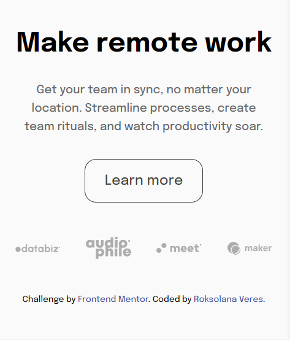
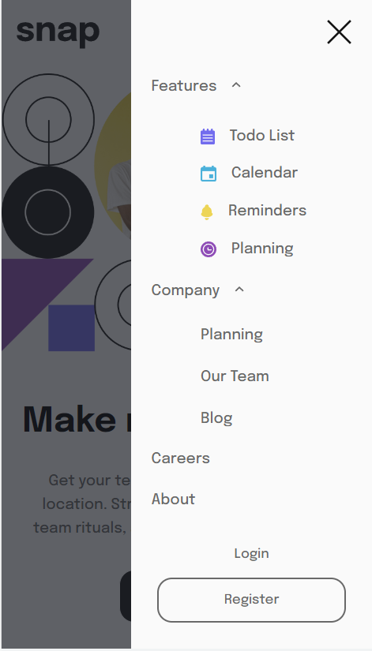

# Frontend Mentor - Intro section with dropdown navigation solution

This is a solution to the [Intro section with dropdown navigation challenge on Frontend Mentor](https://www.frontendmentor.io/challenges/intro-section-with-dropdown-navigation-ryaPetHE5). Frontend Mentor challenges help you improve your coding skills by building realistic projects.

## Table of contents

- [Overview](#overview)
  - [The challenge](#the-challenge)
  - [Screenshots](#screenshots)
  - [Links](#links)
- [My process](#my-process)
  - [Built with](#built-with)
  - [What I learned](#what-i-learned)

## Overview

### The challenge

Users should be able to:

- View the relevant dropdown menus on desktop and mobile when interacting with the navigation links
- View the optimal layout for the content depending on their device's screen size
- See hover states for all interactive elements on the page

### Screenshots

### Links

- [Frontend Mentor solution](https://www.frontendmentor.io/solutions/responsive-intro-section-with-mobilefirst-approach-oEYud8fG_K)
- [GitHub repo](https://github.com/RoksolanaVeres/intro-section-with-dropdown-navigation)
- [Live Site](https://roksolanaveres.github.io/intro-section-with-dropdown-navigation/#)

## My process

### Built with

- Semantic HTML5 markup
- BEM naming approach
- Flexbox
- CSS Grid
- Mobile-first workflow

### What I learned

- Refreshed my knowledge about grids and flex
- Practiced mobile-first approach
- Mastered the implementation of dropdow menues
